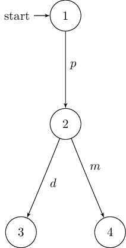
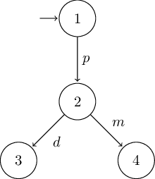
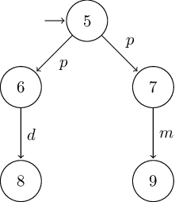

:github_url: https://github.com/phlo/libmc

********
Automata
********

Two main classes of automata are implemented: :ref:`lts` and :ref:`fa`.

.. _lts:

Labelled Transition Systems
===========================

Labelled transition systems are created using the :class:`libmc.LTS` class:

.. literalinclude:: ../../examples/lts.py
  :lines: 5-28

.. note::
  Due to limitations of sets in python (hashability), automata components are
  lists instead of sets.

.. _fa:

Finite Automata
===============

Finite automata are created using the :class:`libmc.FA` class:

.. literalinclude:: ../../examples/fa.py
  :lines: 5-19

.. note::
  As a subclass of :class:`libmc.LTS` they support the same methods and more.

Acceptance
==========

:class:`libmc.FA` supports testing the acceptance of a given word using the
:func:`~libmc.FA.accepts` method:

.. literalinclude:: ../../examples/fa.py
  :lines: 28-30

Completeness and Determinism
============================

Completeness as well as determinism can be checked using
:func:`~libmc.LTS.isComplete` and :func:`~libmc.LTS.isDeterministic`
respectively:

.. literalinclude:: ../../examples/lts.py
  :lines: 31-32

.. literalinclude:: ../../examples/lts.py
  :lines: 35-36

Product
=======

Product automata are created with the :func:`~libmc.LTS.product` method:

.. literalinclude:: ../../examples/lts.py
  :lines: 39

.. literalinclude:: ../../examples/lts.py
  :lines: 41-49

Sub-Set Construction
====================

Power automata are created with the :func:`~libmc.LTS.power` method:

.. literalinclude:: ../../examples/lts.py
  :lines: 52

.. literalinclude:: ../../examples/lts.py
  :lines: 54-55

.. literalinclude:: ../../examples/lts.py
  :lines: 57-76

Complement
==========

The complement of a :class:`libmc.FA` is created with the
:func:`~libmc.FA.complement` method:

.. literalinclude:: ../../examples/fa.py
  :lines: 33

.. literalinclude:: ../../examples/fa.py
  :lines: 35-39

Traces
======

The :func:`~libmc.LTS.trace` method offers a way to find all paths (list of
transitions) from one state to another:

.. literalinclude:: ../../examples/trace.py
  :lines: 17-18

.. literalinclude:: ../../examples/trace.py
  :lines: 20

Conformance
===========

Checking the conformance of one :class:`libmc.FA` to another is carried out with
the :func:`~libmc.FA.conforms` method:

.. literalinclude:: ../../examples/conformance.py
  :lines: 12-45

.. literalinclude:: ../../examples/conformance.py
  :lines: 48

.. literalinclude:: ../../examples/conformance.py
  :lines: 50-51

Simulation
==========

:func:`~libmc.LTS.simulates` can be used to check if a :class:`libmc.LTS` simulates another:

.. literalinclude:: ../../examples/simulation-strong.py
  :lines: 51-53

.. literalinclude:: ../../examples/simulation-strong.py
  :lines: 55-62

.. literalinclude:: ../../examples/simulation-strong.py
  :lines: 64-66

.. literalinclude:: ../../examples/simulation-strong.py
  :lines: 68-72

To just generate the simulation relation, use :func:`libmc.maximumSimulation`:

.. literalinclude:: ../../examples/simulation-strong.py
  :lines: 32-37

.. literalinclude:: ../../examples/simulation-strong.py
  :lines: 39-49

Weak Simulation
---------------

In order to perform a weak simulation, add the set of internal events `τ`:

.. literalinclude:: ../../examples/simulation-weak.py
  :lines: 8-33

.. literalinclude:: ../../examples/simulation-weak.py
  :lines: 35-40

.. literalinclude:: ../../examples/simulation-weak.py
  :lines: 42-48

.. literalinclude:: ../../examples/simulation-weak.py
  :lines: 50-52

.. literalinclude:: ../../examples/simulation-weak.py
  :lines: 54-55

.. literalinclude:: ../../examples/simulation-weak.py
  :lines: 57-59

.. literalinclude:: ../../examples/simulation-weak.py
  :lines: 61-62

Bisimulation
------------

Bisimulations are tested in a similar manner by using
:func:`~libmc.LTS.bisimulates` and :func:`libmc.maximumBisimulation`:

.. literalinclude:: ../../examples/bisimulation.py
  :lines: 39-40

.. literalinclude:: ../../examples/bisimulation.py
  :lines: 32-37

.. literalinclude:: ../../examples/bisimulation.py
  :lines: 42-

Minimization
============

Minimize a deterministic :class:`libmc.FA` with :func:`~libmc.FA.minimize`:

.. literalinclude:: ../../examples/minimization.py
  :lines: 6-27

.. literalinclude:: ../../examples/minimization.py
  :lines: 30

.. literalinclude:: ../../examples/minimization.py
  :lines: 32-43

Asynchronous Composition
========================

Generate the automaton modelling the asynchronous composition of two or
more :class:`libmc.LTS` with :func:`libmc.asynchronousComposition`:

.. literalinclude:: ../../examples/asynchronousComposition.py
  :lines: 6-28

.. literalinclude:: ../../examples/asynchronousComposition.py
  :lines: 31

.. literalinclude:: ../../examples/asynchronousComposition.py
  :lines: 33-55

Partial Order Reduction
-----------------------

Perform partial order reduction by supplying a function choosing the index
of the components used for local expansion:

.. literalinclude:: ../../examples/asynchronousComposition.py
  :lines: 57-58

.. literalinclude:: ../../examples/asynchronousComposition.py
  :lines: 60-

Visualization
=============

Last but not least, automata may be visualized in two ways: either using the
`DOT`_ language or as a customizable `TikZ`_ based LaTeX figure.

DOT
---

:func:`~libmc.LTS.toDot` offers an easy way to generate a graphical
representation of the given automaton using `Graphviz`_ in combination with
`dot2tex`_:

.. literalinclude:: ../../examples/lts.py
  :lines: 79-81

.. literalinclude:: ../../examples/lts.py
  :lines: 83-85

After generating the `DOT`_ language string, use `dot2tex`_ to convert it into a
`TikZ`_ based LaTeX figure:

.. code-block:: shell

  $ dot2tex --template=dot2tex-template.tex /tmp/milner-deterministic-toDot.dot > /tmp/milner-deterministic-toDot.tex
  $ dot2tex --template=dot2tex-template.tex /tmp/milner-nondeterministic-toDot.dot > /tmp/milner-nondeterministic-toDot.tex

Using this minimal
:download:`dot2tex latex template<../../examples/dot2tex-template.tex>` results
in the following graphs:

TikZ
----

:func:`~libmc.LTS.toTex` generates a customizable `TikZ`_ based LaTeX figure
(tikzpicture):

.. literalinclude:: ../../examples/lts.py
  :lines: 88-90

.. literalinclude:: ../../examples/lts.py
  :lines: 92-94

In case of the deterministic version of Milner's vending machine it returns:

.. code-block:: latex

  % requires following LaTex preamble:
  % \usepackage{tikz}
  % \usetikzlibrary{arrows,automata}
  \begin{tikzpicture}[shorten >=1pt,node distance=2cm,auto,initial text=]

    % manual positioning required!
    \node[state,initial]          (1)                          {$1$};
    \node[state]                  (2)                          {$2$};
    \node[state]                  (3)                          {$3$};
    \node[state]                  (4)                          {$4$};

    \path[->]          (1)   edge                node          {$p$} (2);
    \path[->]          (2)   edge                node          {$d$} (3);
    \path[->]          (2)   edge                node          {$m$} (4);
  \end{tikzpicture}

Since no automatic layouting is performed, nodes need to be placed manually.
This might be beneficial if the `DOT`_ file's layout is suboptimal.
To do so, just add the usual `TikZ`_ directives:

.. code-block:: latex
  :emphasize-lines: 8-10

  % requires following LaTex preamble:
  % \usepackage{tikz}
  % \usetikzlibrary{arrows,automata}
  \begin{tikzpicture}[shorten >=1pt,node distance=2cm,auto,initial text=]

    % manual positioning required!
    \node[state,initial]          (1)                          {$1$};
    \node[state]                  (2) [below of=1]             {$2$};
    \node[state]                  (3) [below left of=2]        {$3$};
    \node[state]                  (4) [below right of=2]       {$4$};

    \path[->]          (1)   edge                node          {$p$} (2);
    \path[->]          (2)   edge                node          {$d$} (3);
    \path[->]          (2)   edge                node          {$m$} (4);
  \end{tikzpicture}

The resulting graphs are shown below:

Highlighting Paths
------------------

Additionally, :func:`~libmc.LTS.toDot` and :func:`~libmc.LTS.toTex` are able to
highlight specific paths by passing a list of traces.

.. topic:: Using :func:`~libmc.LTS.toDot`

  .. literalinclude:: ../../examples/lts.py
    :lines: 97

  .. literalinclude:: ../../examples/lts.py
    :lines: 101

  .. image:: img/milner-deterministic-milkyway-toDot.png

  .. image:: img/milner-nondeterministic-milkyway-toDot.png
    :align: right

  |
  |

.. topic:: Using :func:`~libmc.LTS.toTex`

  .. literalinclude:: ../../examples/lts.py
    :lines: 106

  .. literalinclude:: ../../examples/lts.py
    :lines: 110

  .. image:: img/milner-deterministic-milkyway-toTex.png

  .. image:: img/milner-nondeterministic-milkyway-toTex.png
    :align: right

  |
  |

.. _Graphviz: https://www.graphviz.org
.. _DOT: https://graphviz.gitlab.io/_pages/pdf/dotguide.pdf
.. _TikZ: http://mirror.kumi.systems/ctan/graphics/pgf/base/doc/pgfmanual.pdf
.. _dot2tex: https://dot2tex.readthedocs.io
