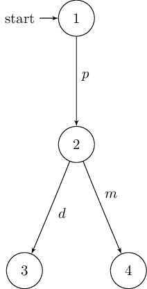
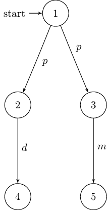
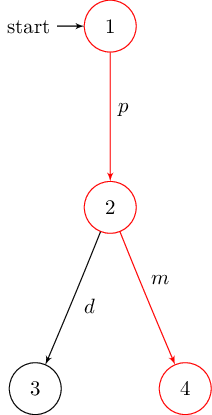
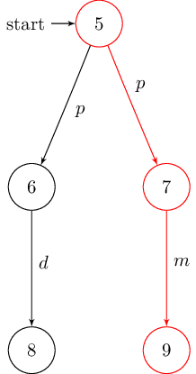

:github_url: https://github.com/phlo/libmc

********
Automata
********

Two main classes of automata are implemented: :ref:`lts` and :ref:`fa`.

.. and can be used for modelling: labelled transistion systems and finite automata.

.. :class:`libmc.LTS` :class:`libmc.FA`

.. _lts:

Labelled Transition Systems
===========================

Labelled transition systems are created using the :class:`libmc.LTS` class:

.. literalinclude:: ../../examples/lts.py
   :lines: 3-28

..
.. .. literalinclude:: ../../examples/lts.py
   .. :lines: 5-15
..
.. .. literalinclude:: ../../examples/lts.py
   .. :lines: 17-28
..
..
.. .. seealso::
   .. `Model Checking Slides - Page 31 <_static/mcslides.pdf#page=31>`_
..
..
.. .. autosummary::
   .. :nosignatures:
..
   .. libmc.LTS
..
.. .. autoclass:: libmc.LTS
   .. :noindex:
..
.. .. automethod:: libmc.LTS.power
   .. :noindex:

.. _fa:

Finite Automata
===============

Finite automata are created using the :class:`libmc.FA` class:

.. literalinclude:: ../../examples/fa.py
   :lines: 3-19

As a subclass of :class:`libmc.LTS` they support the same methods and more.

..
.. .. seealso::
   .. `Model Checking Slides - Page 18 <_static/mcslides.pdf#page=18>`_
..
.. .. autosummary::
   .. :nosignatures:
..
   .. libmc.FA
..
.. :class:`libmc.FA`
..
.. .. autoclass:: libmc.FA
   .. :noindex:
..
.. The difference between labelled transition systems and finite automata is
.. that the latter also include a set of final states.
.. Therefore, :class:`libmc.FA` is a sub class of :class:`libmc.LTS` with the
..
.. :class:`libmc.FA` is a sub class of :class:`libmc.LTS` with an additional set
.. of final states and methods for testing the acceptance of a given word.

Acceptance
==========

:class:`libmc.FA` supports testing the acceptance of a given word using the
:func:`~libmc.FA.accepts` method:

.. literalinclude:: ../../examples/fa.py
   :lines: 28-30

Completeness and Determinism
============================

Completeness as well as determinism can be checked using
:func:`~libmc.LTS.isComplete` and :func:`~libmc.LTS.isDeterministic`
respectively:

.. literalinclude:: ../../examples/lts.py
   :lines: 31-32

.. literalinclude:: ../../examples/lts.py
   :lines: 35-36

..
.. .. seealso::
   .. `Model Checking Slides - Page 21 <_static/mcslides.pdf#page=21>`_

.. Completeness as well as determinism of :ref:`lts` and :ref:`fa` can be checked
.. using :func:`~libmc.LTS.isComplete` and :func:`~libmc.LTS.isDeterministic`
.. respectively.
..
.. .. autosummary::
   .. :nosignatures:
..
   .. libmc.LTS.isComplete
   .. libmc.LTS.isDeterministic

Product
=======

.. Create product automata with :func:`~libmc.LTS.product`.

Product automata are created with the :func:`~libmc.LTS.product` method:

.. literalinclude:: ../../examples/lts.py
   :lines: 39

.. literalinclude:: ../../examples/lts.py
   :lines: 41-49

..
.. .. seealso::
   .. `Model Checking Slides - Page 20 <_static/mcslides.pdf#page=20>`_
..
.. .. autosummary::
   .. :nosignatures:
..
   .. libmc.LTS.product
   .. libmc.FA.product
..
.. To compute the product of two automata, use the following the class methods
.. :func:`libmc.LTS.product` and :func:`libmc.FA.product` can be used.
..
.. * :func:`libmc.LTS.product`
.. * :func:`libmc.FA.product`
..
..
.. .. autosummary::
   .. :nosignatures:
..
   .. libmc.FA.product
   .. libmc.LTS.product
   .. libmc.FA.power
   .. libmc.LTS.power

Sub-Set Construction
====================

Power automata are created with the :func:`~libmc.LTS.power` method:

.. literalinclude:: ../../examples/power.py
   :lines: 5-48

.. note::
   Due to limitations of sets in python (hashability), power automata states
   are tuples instead of sets.

..
.. .. seealso::
   .. `Model Checking Slides - Page 22 <_static/mcslides.pdf#page=22>`_
..
.. :func:`libmc.LTS.power`
.. :func:`libmc.FA.power`
..
.. .. autosummary::
   .. :nosignatures:
..
   .. libmc.FA.power
   .. libmc.LTS.power

Complement
==========

The complement of a :class:`libmc.FA` is created with the
:func:`~libmc.FA.complement` method:

.. literalinclude:: ../../examples/complement.py
   :lines: 5-22

..
.. .. seealso::
   .. `Model Checking Slides - Page 23 <_static/mcslides.pdf#page=23>`_

Traces
======

The :func:`~libmc.LTS.trace` method offers a way to find all traces from one
state to another:

.. literalinclude:: ../../examples/trace.py
   :lines: 17-20

..
.. .. autosummary::
   .. :nosignatures:
..
   .. libmc.LTS.trace

Conformance
===========

Checking the conformance of a :class:`libmc.FA` to another is carried out with
the :func:`~libmc.FA.conforms` method:

..
.. Checking the conformance of a :class:`libmc.FA` modelling the implementation to
.. another one modelling the specification is carried out using the
.. :func:`~libmc.FA.conforms` method.

..
.. .. literalinclude:: ../../examples/conformance.py
   .. :lines: 76-98
..
.. .. image:: ../../../../../../../../../../../tmp/conforms-a.png
..
.. .. image:: ../../../../../../../../../../../tmp/conforms-b.png
   .. :align: right
..
.. .. literalinclude:: ../../examples/conformance.py
   .. :lines: 100-104
..
.. .. image:: ../../../../../../../../../../../tmp/conforms-false.png
   .. :align: center

.. literalinclude:: ../../examples/conformance.py
   :lines: 7-46

Simulation
==========
..
.. Strong Simulation
.. -----------------

:func:`~libmc.LTS.simulates` can be used to check if a :class:`libmc.LTS` simulates another.

To just generate the simulation relation, use :func:`libmc.maximumSimulation`:

.. literalinclude:: ../../examples/simulation-strong.py
   :lines: 32-

Weak Simulation
---------------

In order to perform a weak simulation, add the set of internal events `τ`:

.. literalinclude:: ../../examples/simulation-weak.py
   :lines: 7-

Bisimulation
------------

Bisimulations are tested in a similar manner by using
:func:`~libmc.LTS.bisimulates` and :func:`libmc.maximumBisimulation`:

.. literalinclude:: ../../examples/bisimulation.py
   :lines: 30-

.. .. autosummary::
   .. :nosignatures:
..
   .. libmc.LTS.simulates
   .. libmc.maximumSimulation
   .. libmc.LTS.bisimulates
   .. libmc.maximumBisimulation

Asynchronous Composition
========================

Generate the automaton modelling the asynchronous composition of two or
more :class:`libmc.LTS` with :func:`libmc.asynchronousComposition`:

.. literalinclude:: ../../examples/asynchronousComposition.py
   :lines: 3-

..
.. .. image:: img/asynchronousComposition.png
   .. :scale: 50%
   .. :align: center

Partial Order Reduction
-----------------------

Perform partial order reduction by supplying a function choosing the index
of the components used for local expansion:

.. literalinclude:: ../../examples/asynchronousComposition.py
   :lines: 56-

..
.. .. image:: img/partialOrderReduction.png
   .. :scale: 50%
   .. :align: center

.. .. autosummary::
   .. :nosignatures:
..
   .. libmc.asynchronousComposition

Visualization
=============

Last but not least, :func:`~libmc.LTS.toDot` offers a way to generate a
graphical representation of the given automaton using `Graphviz`_ in combination
with `dot2tex`_.

.. literalinclude:: ../../examples/lts.py
   :lines: 52-58

After generating the DOT language string, use `dot2tex`_ to convert it into a
`TikZ`_ based LaTeX figure:

.. code-block:: shell

   $ dot2tex --template=dot2tex-template.tex /tmp/milner-deterministic.dot > /tmp/milner-deterministic.tex
   $ dot2tex --template=dot2tex-template.tex /tmp/milner-nondeterministic.dot > /tmp/milner-nondeterministic.tex

Using this minimal
:download:`dot2tex latex template<../../examples/dot2tex-template.tex>`
results in the following graphs:

Highlighting Paths
------------------

Additionally, :func:`~libmc.LTS.toDot` is able to highlight specific paths:

.. literalinclude:: ../../examples/lts.py
   :lines: 60-67

.. _Graphviz: https://www.graphviz.org
.. _TikZ: http://mirror.kumi.systems/ctan/graphics/pgf/base/doc/pgfmanual.pdf
.. _dot2tex: https://dot2tex.readthedocs.io
